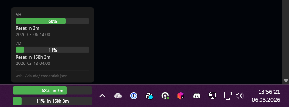

# Claude Usage Widget

A small WPF widget that sits in the Windows taskbar and shows your current Claude AI (and Codex) usage — 5-hour session limit and 7-day rolling limit. Supports multiple accounts side by side.

Requires [.NET 8 Desktop Runtime](https://dotnet.microsoft.com/download/dotnet/8) (x64 or ARM64).

Appears in the bottom-right corner of every monitor, next to the system tray.



## Installation

1. Download `ClaudeUsageWidget-win-x64.exe` (or `win-arm64`) from [Releases](../../releases)
2. Place the exe anywhere (e.g. `C:\Tools\ClaudeUsageWidget.exe`)
3. Run it — the widget appears in the bottom-right corner of each monitor, next to the system tray
4. Right-click → **Run at startup** to launch it automatically on login

## Credentials

The widget looks for credentials in the following locations and shows one panel per unique account:

**Claude:**
1. **WSL** — `~/.claude/.credentials.json` (via `wsl.exe`) — preferred
2. **Windows** — `%USERPROFILE%\.claude\.credentials.json` — fallback

Accounts with the same org ID are deduplicated (one panel shown).

**Codex:**
1. **WSL** — `~/.codex/auth.json`
2. **Windows** — `%USERPROFILE%\.codex\auth.json`

Credentials are generated by [Claude Code CLI](https://claude.ai/code) / Codex CLI when you log in. If you have the CLI installed in WSL, those credentials take priority.

## How it works

Each account is shown as a separate column with a service icon (orange **C** for Claude, blue **X** for Codex) and two progress bars (5h + 7d). The widget width adjusts dynamically based on the number of accounts.

Hovering over a panel shows the utilization percentage and time until reset for that account.

Usage data is fetched by calling `api.anthropic.com/v1/messages` with a minimal request. The rate limit data is returned in the response headers:

- `anthropic-ratelimit-unified-5h-utilization`
- `anthropic-ratelimit-unified-7d-utilization`
- `anthropic-ratelimit-unified-5h-reset`
- `anthropic-ratelimit-unified-7d-reset`

Progress bar color: green (< 75%), orange (75–90%), red (≥ 90%).

If the API call fails, both bars turn dark red (maroon) and show "Error". The widget auto-retries every minute.

The widget automatically hides when:
- The taskbar is set to auto-hide and slides down
- A fullscreen application is running on the same monitor

It reappears when the taskbar comes back or the fullscreen app is closed.

---

> **Note:** This is not a native Windows widget (Win+W panel). It is a standalone borderless WPF window that pins itself to the taskbar next to the system tray and stays always on top. The reason: the native widget API requires an MSIX package and COM registration, which needs Developer Mode enabled and a complicated install process.

## Development

Requires [.NET 8 SDK](https://dotnet.microsoft.com/download/dotnet/8).

```powershell
make run    # dotnet run (Debug — Run at startup is grayed out)
make build  # dotnet build
```

Solution: `ClaudeUsageWidget.sln`
